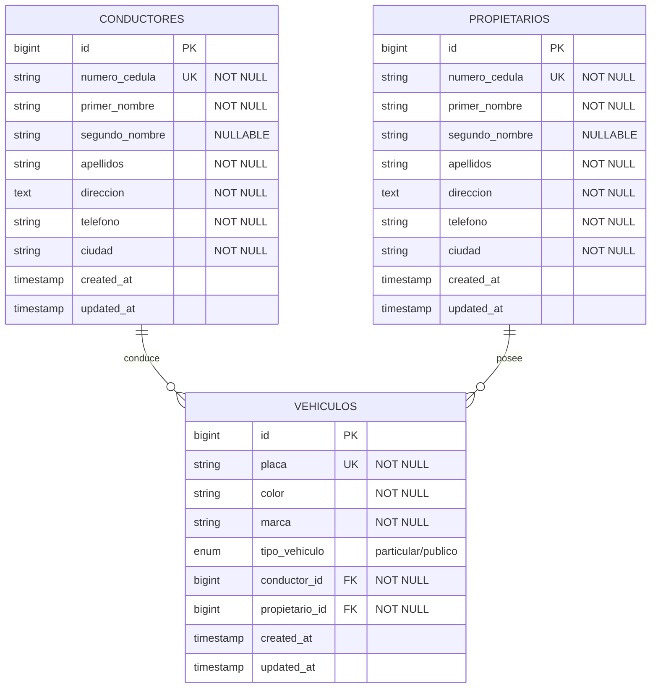

# Modelo Entidad-Relación - ACME Transportes

## 📊 Diagrama ER (Sintaxis Mermaid)



## 📋 Descripción de Relaciones

### CONDUCTORES → VEHICULOS (1:N)
- **Tipo:** Uno a Muchos
- **Descripción:** Un conductor puede tener múltiples vehículos asignados
- **Llave Foránea:** `vehiculos.conductor_id` → `conductores.id`
- **Cardinalidad:** 1 conductor puede conducir 0 o muchos vehículos

### PROPIETARIOS → VEHICULOS (1:N)
- **Tipo:** Uno a Muchos
- **Descripción:** Un propietario puede tener múltiples vehículos
- **Llave Foránea:** `vehiculos.propietario_id` → `propietarios.id`
- **Cardinalidad:** 1 propietario puede poseer 0 o muchos vehículos

## 🔑 Restricciones de Integridad

### Conductores
- **PK:** `id` (auto-incremental)
- **UK:** `numero_cedula` (único)
- **Índices:** `numero_cedula`

### Propietarios
- **PK:** `id` (auto-incremental)
- **UK:** `numero_cedula` (único)
- **Índices:** `numero_cedula`

### Vehículos
- **PK:** `id` (auto-incremental)
- **UK:** `placa` (único)
- **FK:** `conductor_id` (CASCADE ON DELETE)
- **FK:** `propietario_id` (CASCADE ON DELETE)
- **Índices:** `placa`, `conductor_id`, `propietario_id`

## 📊 Diagrama Visual ASCII

```
┌─────────────────────┐
│    CONDUCTORES      │
├─────────────────────┤
│ PK id               │
│ UK numero_cedula    │
│    primer_nombre    │
│    segundo_nombre   │
│    apellidos        │
│    direccion        │
│    telefono         │
│    ciudad           │
│    created_at       │
│    updated_at       │
└─────────────────────┘
           │
           │ 1
           │
           │ conduce
           │
           │ N
           ▼
┌─────────────────────┐        ┌─────────────────────┐
│     VEHICULOS       │        │   PROPIETARIOS      │
├─────────────────────┤        ├─────────────────────┤
│ PK id               │        │ PK id               │
│ UK placa            │        │ UK numero_cedula    │
│    color            │        │    primer_nombre    │
│    marca            │        │    segundo_nombre   │
│    tipo_vehiculo    │◄───────┤    apellidos        │
│ FK conductor_id     │  posee │    direccion        │
│ FK propietario_id   │   1:N  │    telefono         │
│    created_at       │        │    ciudad           │
│    updated_at       │        │    created_at       │
└─────────────────────┘        │    updated_at       │
                               └─────────────────────┘
```

## 📐 Reglas de Negocio

1. **Unicidad de Cédulas:** Cada conductor y propietario debe tener una cédula única
2. **Unicidad de Placas:** Cada vehículo debe tener una placa única
3. **Obligatoriedad:** Todo vehículo DEBE tener un conductor y un propietario
4. **Tipos de Vehículo:** Solo se permiten dos tipos: 'particular' o 'publico'
5. **Eliminación en Cascada:** Si se elimina un conductor o propietario, se eliminan sus vehículos asociados
